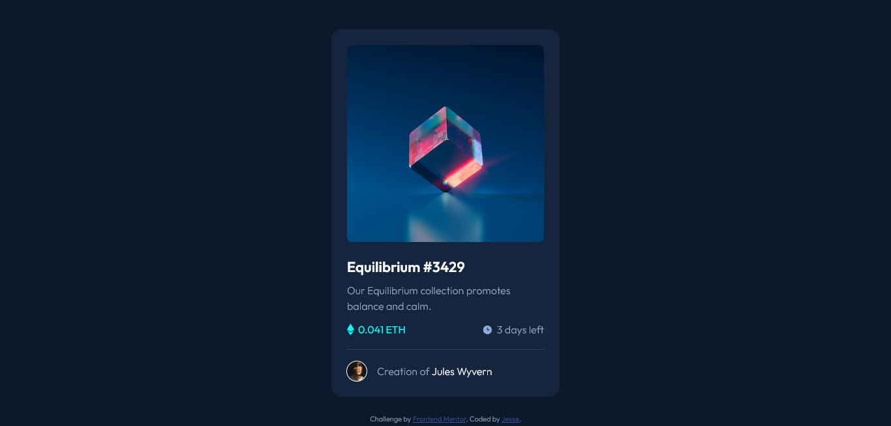

# Frontend Mentor - NFT preview card component solution

This is a solution to the [NFT preview card component challenge on Frontend Mentor](https://www.frontendmentor.io/challenges/nft-preview-card-component-SbdUL_w0U). Frontend Mentor challenges help you improve your coding skills by building realistic projects.

## Table of contents

- [Overview](#overview)
  - [The challenge](#the-challenge)
  - [Screenshot](#screenshot)
  - [Links](#links)
- [My process](#my-process)
  - [Built with](#built-with)
  - [What I learned](#what-i-learned)
- [Author](#author)
- [Acknowledgments](#acknowledgments)

## Overview

### The challenge

Users should be able to:

- View the optimal layout depending on their device's screen size
- See hover states for interactive elements

### Screenshot

### Links

- Solution URL: [See code on github](https://github.com/vinshield/nft-preview-card-component-main)
- Live Site URL: [Visit live site](https://vinshield.github.io/nft-preview-card-component-main/)

## My process

### Built with

- Semantic HTML5 markup
- CSS custom properties
- Flexbox
- CSS Grid
- Mobile-first workflow

### What I learned

I just used this exercise to practice the basics a little, nothing serious. I'm only filling out this section because I'm encouraged to do so by Frontend Mentor.

Edit: Syke! I had forgotten to add the beautiful hover effect on the image. That turned out to be the most challenging part of this project and I thoroughly enjoyed it!

From the getgo I decided that although I could immediately think of ways to apply the hover effect using javascript, I would stick to only html and css. This turned out to be more challenging than I had expected. I watched a few youtube videos then I decided to add an `.overlay` div whose opacity would first be 0 and then change to 1 on hover.

While I had to option of placing the actual image as a background on an otherwise empty `.img-div` and then applying the overlay image on hover, I chose the former method because it provided the convenience of keeping the image size the same across varying screen sizes without having to specify the height and width of the `.img-div`.

## Author

- Frontend Mentor - [@vinshield](https://www.frontendmentor.io/profile/vinshield)
- Twitter - [@jeslelacodes](https://www.twitter.com/jeslelacodes)

## Acknowledgements

Thanks to the creator of this video, it helped with applying the overlay image on hover - [link to video](https://www.youtube.com/watch?v=jAXF7oS0RB4&t=191s)
